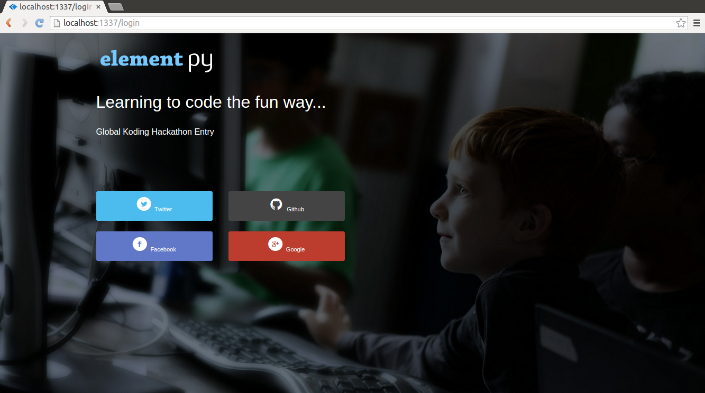
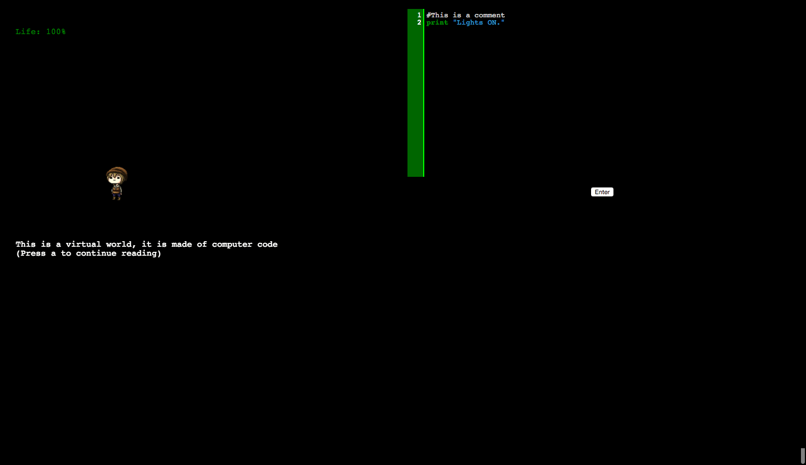

# Element Py
Element Py is a new, engaging, and fun way to learn **Object-Oriented Python (2.7)**.

## Description
The concept of the game is simple: *write to code to survive*. From turning on the lights with a simple `print "Lights on!"` to writing custom upgrades to weapons and in-game objects, Element Py teaches the player key ideas from the basic use of the Python interpreter to inheritance and method overriding. 

## Screenshots

This is a mock up of the login page, giving users the option to login with their existing accounts for convenience. 

This is demo gameplay, during the first level introduction. One the left is the game canvas, on the right is the Python 2.7 interpreter. 

## APIs used
None

##Libraries used

1. [JSREPL](https://github.com/replit/jsrepl "JSRepl")
2. [PixiJS](http://www.pixijs.com/ "PixiJS")
3. [CodeMirror](http://codemirror.net/ "CodeMirror")
4. [Sails](http://sailsjs.org/ "Sails")
